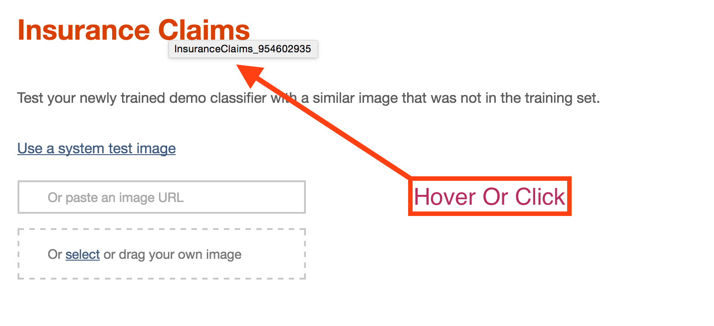

# Visual Recognition Demo
[](https://travis-ci.org/watson-developer-cloud/visual-recognition-nodejs?branch=master)
[](https://codecov.io/github/watson-developer-cloud/visual-recognition-nodejs?branch=master)

The [Visual Recognition][visual_recognition_service] Service uses deep learning algorithms to analyze images for scenes, objects, faces, text, and other subjects that can give you insights into your visual content. You can organize image libraries, understand an individual image, and create custom classifiers for specific results that are tailored to your needs.

Give it a try! Click the button below to fork into IBM DevOps Services and deploy your own copy of this application on the IBM Cloud.

[](https://bluemix.net/deploy?repository=https://github.com/watson-developer-cloud/visual-recognition-nodejs)

## Getting Started

1. You need a IBM Cloud account. If you don't have one, [sign up][sign_up]. Experimental Watson Services are free to use.

2. Download and install the [Cloud-foundry CLI][cloud_foundry] tool if you haven't already.

3. Edit the `manifest.yml` file and change `<application-name>` to something unique. The name you use determines the URL of your application. For example, `<application-name>.mybluemix.net`.
  ```yaml
  ---
  declared-services:
    visual-recognition-service:
      label: watson_vision_combined
      plan: free
  applications:
  - name: <application-name>
    path: .
    command: npm start
    memory: 512M
    services:
    - visual-recognition-service
    env:
      NODE_ENV: production
  ```

4. Connect to the IBM Cloud with the command line tool.

  ```sh
  cf api https://api.ng.bluemix.net
  cf login
  ```

5. Create the Visual Recognition service in the IBM Cloud.
  ```sh
  cf create-service watson_vision_combined free visual-recognition-service
  cf create-service-key visual-recognition-service myKey
  cf service-key visual-recognition-service myKey
  ```

6. Create a `.env` file in the root directory by copying the sample `.env.example` file using the following command:

  ```none
  cp .env.example .env
  ```
  You will update the `.env` with the information you retrieved in steps 5 and 6

  The `.env` file will look something like the following:

  ```none
  VISUAL_RECOGNITION_API_KEY=
  ```

7. Install the dependencies you application need:

  ```none
  npm install
  ```

8. Start the application locally:

  ```none
  npm start
  ```

9. Point your browser to [http://localhost:3000](http://localhost:3000).

10. **Optional:** Push the application to the IBM Cloud:

  ```none
  cf push
  ```

After completing the steps above, you are ready to test your application. Start a browser and enter the URL of your application.

            <your application name>.mybluemix.net


For more details about developing applications that use Watson Developer Cloud services in the IBM Cloud, see [Getting started with Watson Developer Cloud and the IBM Cloud][getting_started].

## Environment Variables

  - `VISUAL_RECOGNITION_API_KEY` : This is the API key for the vision service, used if you don't have one in your IBM Cloud account.
  - `PRESERVE_CLASSIFIERS` : Set if you don't want classifiers to be deleted after one hour. *(optional)*
  - `PORT` : The port the server should run on. *(optional, defaults to 3000)*
  - `OVERRIDE_CLASSIFIER_ID` : Set to a classifer ID if you want to always use a custom classifier. This classifier will be used instead of training a new one. *(optional)*

## Changing the Included Images

### Sample Images

The sample images are the first 7 images when the site loads.  They
are called from a Jade mixin found in
`views/mixins/sampleImages.jade`.  If you just want to replace those
images with different images, you can replace them in
`public/images/samples` and they are numbered 1 - 7 and are `jpg`
formatted.

### Custom Classifier Bundles

Adding new/different custom classifer bundles is much more invovled.
You can follow the template of the existing bundles found in
`views/includes/train.jade`.

Or, you can train a custom classifier using the api or the form and
then use the classifier ID.

## Getting the Classifier ID

When you train a custom classifier, the name of the classifier is
displayed in the test form.



If you hover your mouse over the classifier name, the classifier ID
will be shown in the tooltip. You can also click on the name, and it
will toggle between the classifier name and the classifier ID.

You can then use this custom classifier id by placing it after the hash
in the request URL.  For example, lets say you are running the system
locally, so the base URL is `http://localhost:3000` and then you train
a classifier.  This newly trained classifier might have an id like
`SatelliteImagery_859438478`.   If you wanted to use this classifier
instead of training a new one, you can navigate to
`http://localhost:3000/train#SatelliteImagery_859438478` and use the
training form with your existing classifier.

## License

  This sample code is licensed under Apache 2.0. Full license text is available in [LICENSE](LICENSE).

## Contributing

  See [CONTRIBUTING](CONTRIBUTING.md).

## Open Source @ IBM
  Find more open source projects on the [IBM Github Page](http://ibm.github.io/).


[deploy_track_url]: https://github.com/cloudant-labs/deployment-tracker
[service_url]: https://www.ibm.com/watson/services/visual-recognition/
[cloud_foundry]: https://github.com/cloudfoundry/cli
[visual_recognition_service]: https://www.ibm.com/watson/services/visual-recognition/
[sign_up]: https://console.bluemix.net/registration/
[getting_started]: https://console.bluemix.net/docs/services/watson/index.html#about
[node_js]: http://nodejs.org/
[npm]: https://www.npmjs.com


